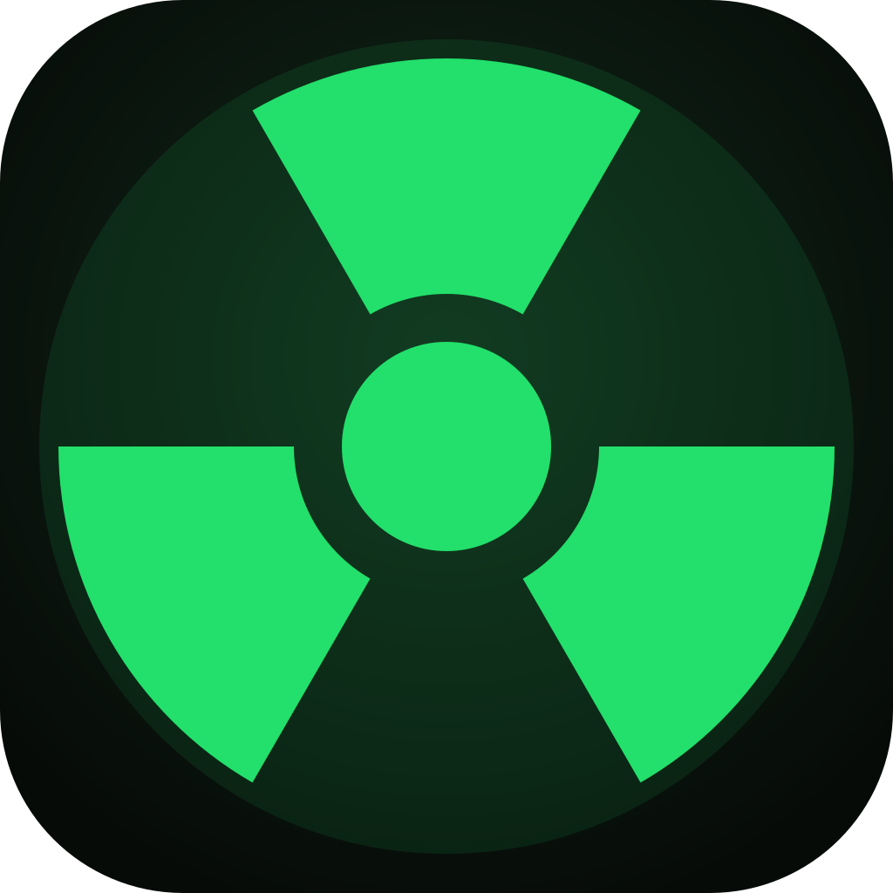

<div align="center">



# ☢️ Debloatranium

### The Ultimate Windows Optimizer &amp; Debloater

**Fast · Glassmorphism UI · Expert control · No AI slop**

Turn a cluttered, slow Windows into a lean, private, high-performance machine — through one beautiful step-by-step wizard.

[](https://github.com/Emre1001/Debloatranium/releases/latest)
&nbsp;
[](LICENSE)


</div>

---

## 🌍 What is it?

**Debloatranium** is a premium, open-source system utility for Windows. Instead of a wall of cryptic checkboxes, it walks you through a guided, animated wizard — pick a level, choose your apps, hit **Construct**, watch it build your perfect OS on a fullscreen progress screen.

Built on **Tauri** (Rust + WebView2): a single **~8 MB portable `.exe`**, ~40 MB RAM, native speed. Runs on virtually any Windows 10 (1803+) or 11 machine — no install, no .NET, no bloat.

## ✨ Features

| | |
|---|---|
| 💎 **Glassmorphism UI** | Liquid-glass dark design, neon-green accents, real OS acrylic blur, fully animated. |
| 🌐 **Multi-language** | English, German, Turkish — switch live. |
| 🎚️ **Modus Slider** | Drag from **Minimal → Balanced → Aggressive → Zero ☢️**. Or go full **Custom**. |
| ⚡ **Performance** | High-performance power plan, kill Game Bar &amp; background apps, drop visual effects, clean temp files. |
| 🛡️ **Privacy &amp; Telemetry** | Disable telemetry, Advertising ID, Cortana, activity history, location, error reporting, tailored ads, CEIP. |
| 🎮 **GPU Driver Auto-Install** | Detects **NVIDIA / AMD / Intel** and installs the latest official driver. |
| 📦 **App Setup + Search** | 30+ apps across 6 categories with live search (Steam, Firefox, VS Code, OBS, Discord…). **WinRAR every time.** |
| ↩️ **System Restore Point** | Creates a safety snapshot before touching anything. |
| 🗑️ **Debloat** | Remove Copilot, Solitaire, News, Clipchamp, Xbox — and even **uninstall Microsoft Edge**. |
| 🔐 **Self-elevation** | One click to relaunch as Administrator when needed. |
| 🚀 **Fullscreen Loader** | Live progress as your system is constructed, then a one-click **Restart PC**. |

## 📸 The Flow

```
Welcome → Hardware → Mode → (Modus slider | Custom tweaks) → Apps → Review → ☢️ Construct → Done
```

> A landing page lives in [`website/`](website/index.html) — open it in any browser.

## 🚀 Getting Started

### Download (recommended)
1. Grab the latest **`Debloatranium.exe`** from [Releases](https://github.com/Emre1001/Debloatranium/releases/latest).
2. Run as **Administrator**.
3. Slide to your level, pick your apps, hit **Construct**.

### Build from source
```powershell
git clone https://github.com/Emre1001/Debloatranium.git
cd Debloatranium
npm install
npm run tauri dev        # live dev window
npm run tauri build      # -> src-tauri/target/release/Debloatranium.exe
```
Regenerate the icon after editing `scripts/make-icon.mjs`:
```powershell
node scripts/make-icon.mjs
npm run tauri icon src-tauri/icon-src.png
```

## 🧩 Tech Stack

| Layer | Tech | Why |
|---|---|---|
| Shell | **Tauri v2** | ~8 MB exe, native, uses preinstalled WebView2 |
| Frontend | **React + TypeScript + Tailwind v4 + Framer Motion** | modern, animated, dark |
| Backend | **Rust** + `winreg` + `window-vibrancy` | native registry edits, real acrylic blur |
| Installs | **winget** | official driver &amp; app packages |

### Project layout
```
Debloatranium/
├─ src/                 React UI (wizard, steps, components)
│  ├─ data/             tweak + app catalogs (data-driven, easy to extend)
│  └─ components/       Slider, Dropdown, TweakCard…
├─ src-tauri/src/lib.rs Rust engine: registry, services, winget, restore, GPU
├─ website/             download landing page
└─ scripts/make-icon.mjs  generates the radioactive icon
```
Want more tweaks/apps? Add one line in [`src/data/tweaks.ts`](src/data/tweaks.ts) or [`src/data/apps.ts`](src/data/apps.ts).

## ⚠️ Disclaimer

Debloatranium edits the registry, services and installs software.
- Registry toggles are **reversible** (off = Windows default); a **Restore Point** is offered first.
- App removals and **Edge uninstall** are one-way (Edge removal is *experimental* — Windows Update may restore it).
- Telemetry/service/driver actions need **Administrator**.
- Use at your own risk. Review what you enable. 💚

## 🤝 Contributing

PRs welcome — new tweaks, apps, translations, themes. Open an issue first for big changes.

## 🎁 Support

If Debloatranium made your PC faster:

[](https://paypal.me/Emre100120)

## ⚖️ License

[MIT](LICENSE) © [Emre1001](https://github.com/Emre1001)

<div align="center">
<sub>Created with 💚 and ☢️ — no AI slop.</sub>
</div>
